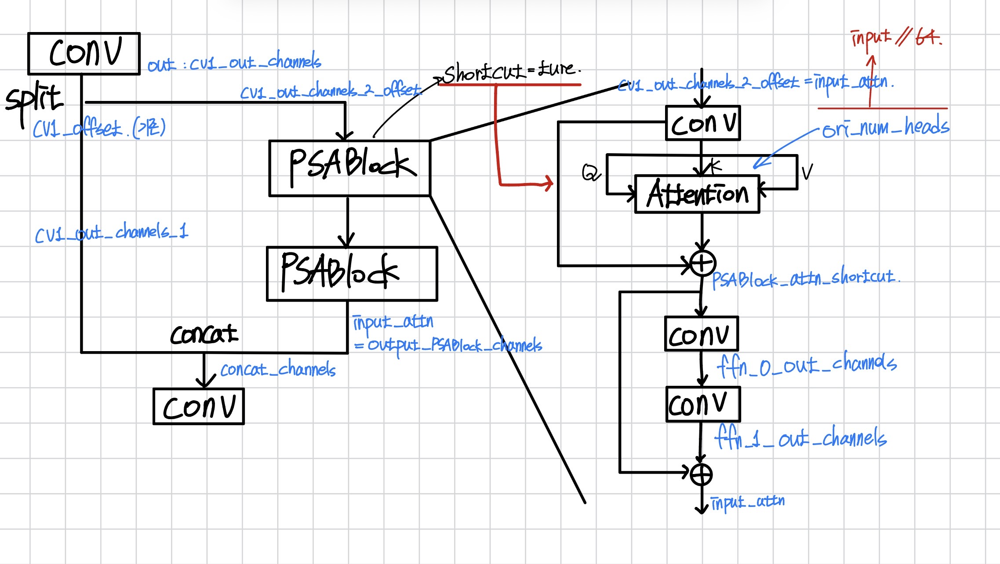

# YOLO26 Pruning

Ultralytics 기반 YOLO26 모델에 채널/구조적 pruning을 적용하고, 재구성된 모델을 바로 fine-tuning하는 프로젝트입니다.

## 주요 파일

- `yolo26/prune_finetune.py`: pruning 후 fine-tuning 실행 스크립트
- `yolo26/compress/Compress.py`: pruning, 구조 재구성, pruned checkpoint/yaml 저장 로직
- `yolo26/compress/GM.py`: GM(Geometric Median) 기반 structured pruning 구현
- `yolo26/train_baseline_model.py`: baseline 모델 학습 스크립트
- `yolo26/eval.py`: 모델 평가 스크립트
- `dataset.yaml`: 학습/검증 데이터 경로 및 클래스 설정
- `asset/C2PSA.jpeg`: C2PSA 구조와 channel 변수 정리 이미지

## Architecture 이미지

`asset/C2PSA.jpeg`는 YOLO26 pruning 과정에서 C2PSA 블록의 구조와 channel pruning에 필요한 channel 변수를 정리한 이미지입니다.



## 설치

```bash
cd yolo26
conda create -n yolo26 python=3.10 -y
pip install -r requirements.txt
pip install polars
pip install -e .
```

Conda 환경을 쓰는 경우 예시:

```bash
conda activate yolo26
cd /home/a/yolo26_pruning/yolo26
pip install -e .
```

## 데이터셋

데이터셋은 repository root의 `dataset/` 디렉터리에 배치합니다.

`dataset.yaml`은 root 기준 경로를 사용하며, `prune_finetune.py`는 `yolo26/` 디렉터리 안에서 실행하는 것을 기준으로 `../dataset.yaml`을 읽습니다.

## Pruning + Fine-tuning

`yolo26/` 디렉터리에서 실행합니다.

```bash
cd /home/a/yolo26_pruning/yolo26

python prune_finetune.py \
  --bmodel ../test_model.pt \
  --pruning_ratio 0.5 \
  --prune_type ALL \
  --method L2 \
  --cfg_output_path prune \
  --epoch 100 \
  --name yolo26_pruned \
  --bs 2 \
  --device 0
```

### 주요 옵션

- `--bmodel`: pruning할 baseline/pretrained checkpoint 경로
- `--pruning_ratio`: 최종 파라미터/FLOPs 감소 목표 비율. 예: `0.5`는 약 50% pruning 목표
- `--prune_type`: pruning 대상
  - `B`: backbone
  - `H`: head
  - `ALL`: Detect head를 제외한 backbone + neck/head feature layers
- `--method`: pruning 기준 (`L1`, `L2`, `GM`)
- `--cfg_output_path`: pruned checkpoint와 yaml을 저장할 디렉터리
- `--epoch`: fine-tuning epoch 수
- `--name`: Ultralytics run name
- `--bs`: batch size
- `--device`: 학습 GPU/CPU 지정
- `--resume_path`: 저장된 checkpoint에서 resume할 때 사용

`--pruning_ratio`는 최종 감소율을 기준으로 받습니다. 내부적으로는 input/output 채널이 함께 줄어드는 효과를 고려해 다음 비율로 Conv output pruning amount를 계산합니다.

```python
amount = 1 - sqrt(1 - pruning_ratio)
```

## 출력 산물

기본 설정(`--cfg_output_path prune`) 기준:

- `yolo26/prune/best_model_prune.pt`: 구조 재구성까지 완료된 pruned checkpoint
- `yolo26/prune/best_model_prune.yaml`: pruned 구조 참고용 yaml
- `yolo26/checkpoints/<name>/`: fine-tuning 결과

현재 fine-tuning은 pruned yaml로 새 모델을 다시 만들지 않고, pruning 후 재구성된 모델 객체를 그대로 trainer에 전달합니다. 이 흐름은 구조 내부 hidden channel까지 보존하기 위한 것입니다.

## Resume

중단된 학습을 이어서 실행할 때:

```bash
cd /home/a/yolo26_pruning/yolo26

python prune_finetune.py \
  --resume_path checkpoints/yolo26_pruned/weights/last.pt \
  --name yolo26_pruned_resume \
  --bs 2 \
  --device 0
```

## 구현 메모

- Detect head 자체는 pruning하지 않습니다.
- Detect head의 입력 feature channel은 앞단 pruning 결과에 맞게 slicing합니다.
- Conv 계층은 output channel뿐 아니라 다음 layer와 맞도록 input channel dimension도 실제로 slicing합니다.
- `C3k2`는 `chunk(2, 1)`/concat 구조가 깨지지 않도록 split 양쪽 channel set을 맞춥니다.
- `C2PSA` attention 내부는 안정성을 위해 공격적으로 줄이지 않고, 입출력 구조 중심으로 맞춥니다.
- pruned yaml에는 `exact_channels: true`를 기록합니다. 다만 fine-tuning은 pruned 모델 객체를 직접 사용하므로 yaml은 주로 구조 확인/참고용입니다.

## 정상 동작 확인 포인트

학습 시작 시 다음을 확인합니다.

- `Transferred ... items from pretrained weights`가 뜨지 않아야 합니다.
- summary의 Detect 입력 channel이 줄어 있어야 합니다. 예: `[45, 91, 181]`
- 파라미터 수와 GFLOPs가 baseline보다 감소해야 합니다.
- fine-tuning 초반 validation mAP가 0으로 고정되지 않고 회복되어야 합니다.
